  

  
  
  
  
  
  
  

---

# ⚽ Awesome Video Analysis (Sports) 📊

**A Curated Directory of Enterprise SaaS Platforms, AI Computer Vision Frameworks & Open-Source Tools**  
*Targeted at Sports Video Analysis, Multi-Object Player Tracking, Biomechanical Pose Estimation, Telestration, Tactical Tagging, and Performance Intelligence.*  

📅 **Last Updated:** August 2026

---

## 📖 Overview & SEO Summary

Modern **Sports Video Analysis** bridges elite athletic coaching, tactical match analysis, computer vision, and machine learning. This repository tracks the most powerful **commercial SaaS platforms** and **open-source GitHub repositories** enabling:
- 🎯 **Object Detection & Multi-Object Tracking (MOT):** Real-time player, referee, and high-speed ball tracking across pitch and court sports.
- 📐 **Kinematics & Biomechanics:** 2D/3D markerless motion capture, joint angle estimation, and velocity measurement from monocular or multi-view video feeds.
- 🎨 **Telestration & Tactical Tagging:** Dynamic pitch drawing, timeline event tagging, playlist curation, and visual coaching presentations.
- 🤖 **Automated Capture & AI Broadcasting:** Panoramic sports cameras, auto-framing, cloud processing, and spatio-temporal data parsing.

---

## 📑 Table of Contents

- [🏢 SaaS & Hosted Platforms](#-saas--hosted-platforms)
- [💻 Open-Source GitHub Projects](#-open-source-github-projects)
- [⭐ Star History](#-star-history)
- [🤝 How to Contribute](#-how-to-contribute)
- [📜 Disclaimer](#-disclaimer)

---

## 🏢 SaaS & Hosted Platforms

Below is the curated selection of commercial sports video analysis suites, sorted in **descending order by company scale (revenue/valuation)**:

| 🏅 Product | 📝 Description | 💼 Company Size / Valuation | 💰 Pricing | 🎁 Free Tier / Trial Limit |
| :--- | :--- | :--- | :--- | :--- |
| **[Hudl](https://www.hudl.com/)** | Comprehensive sports video and performance-analysis platform for recording, reviewing, tagging, sharing, scouting, and analyzing games and training sessions. | ~$730.4M ARR / $1.5B+ Valuation (Private, $230M+ raised) | Starts at ~$400/team/year (Bronze tier; club packages range $400–$2,500/year) | 14-day free trial (access to standard tagging, clip creation, and video breakdown; no permanent free tier) |
| **[Hudl Sportscode](https://www.hudl.com/products/sportscode)** | Professional performance-analysis environment for live and post-match coding, video tagging, tactical analysis, and collaborative coaching workflows. | ~$730.4M ARR / $1.5B+ Valuation (Hudl Enterprise / Elite Division) | Starts at ~$3,000/seat/year (custom institutional quote based on Elite/Pro features and capture inputs) | No self-serve free trial (institutional live demo and guided trial on request; no permanent free tier) |
| **[Catapult Vision](https://www.catapult.com/)** | Sports video-analysis and performance platform integrated with Catapult's athlete-performance ecosystem for combining video and wearable tracking data. | ~$140.7M FY26 Revenue / ~$983M Market Cap (Public: ASX: CAT) | Starts at ~$180/player/year (Catapult One) / ~$2,500+/team/year for Vision Pro Video | No public free trial (guided product demonstration and team pilot available upon request; no permanent free tier) |
| **[Veo](https://www.veo.co/)** | AI-assisted automated sports camera and analysis platform designed to record matches, follow play automatically, and generate searchable game footage. | $50M–$100M Revenue / ~$300M Valuation ($115M Funding) | Starts at ~$67/month (or $40–$67/month for Starter subscription; camera hardware sold separately) | No hardware/cloud free trial (mandatory subscription with hardware; interactive online platform demo available; no permanent free tier) |
| **[Coach Paint](https://www.coachpaint.com/)** | Sports coaching video-analysis tool specializing in broadcast-grade telestration, dynamic drawing, tactical explanations, and visual feedback for athletes. | ~$58.2M–$82.3M Revenue (ChyronHego / Vector Capital) | Starts at $49/month or $499/year (Coach Paint Lite) | 7-day free trial (full access to core telestration, drawings, and clip export; no permanent free tier) |
| **[Spiideo](https://www.spiideo.com/)** | Automated sports video platform combining AI-powered panoramic capture, recording, live streaming, cloud analysis, and league-wide video access. | ~$22M Revenue / ~€105M ($115M) Valuation (Private, $30M+ raised) | Starts at ~$3,800/year (camera hardware + cloud analysis subscription bundle for single team/venue) | No self-serve free trial (guided product demo & venue workflow evaluation available on request; no permanent free tier) |
| **[Dartfish](https://www.dartfish.com/)** | Sports video-analysis platform focused on video capture, tagging, telestration, biomechanics, side-by-side comparison, and coach-athlete feedback. | ~$12.8M–$25M Revenue (Private / Industry Pioneer) | Starts at ~€7/month billed annually (€84/year for myDartfish Mobile) / $80/year for myDartfish Express | 15-day free trial (full access to test motion analysis, capture, and cloud sharing tools; no permanent free tier) |
| **[Trace](https://www.traceup.com/)** | Automated sports-video platform using cameras and AI to capture games, generate personalized highlights, and provide player-focused tactical analysis. | >$10M Revenue / ~$190M Valuation (Series C, $65.2M Funding) | Starts at $180/year ($25/month for Basic Family Plan with 2 seats; Pro at $300/year) | No free trial (subscription required to access PlayerCam and game footage; free camera hardware promo on multi-family signups; no permanent free tier) |
| **[Nacsport](https://www.nacsport.com/)** | Professional sports-analysis software for tagging match events, creating custom analysis workflows, generating reports, and building video presentations. | ~$4.2M Revenue (Bootstrapped / Independent Leader) | Starts at ~$165/year (Basic subscription) / Lifetime licenses starting at ~$350+ one-time | 30-day free trial (unrestricted access to test any Nacsport tier including Basic, Scout, or Pro; no permanent free tier) |
| **[LongoMatch](https://www.longomatch.com/)** | Sports video-analysis platform focused on tagging plays, reviewing events, creating playlists, and producing analysis presentations. | ~$3M–$5M Revenue (Fluendo Subsidiary) | Free forever tier available; paid Starter plan starts at €12.50/month (billed annually) / Pro at €45.84/month | Free forever plan (Basic) includes 1 dashboard, max 50 events per project, local webcam capture, and drawing tools |
| **[Performa Sports](https://www.performa-sports.com/)** | Sports performance-analysis platform providing iPad-based video coding, tactical analysis, cloud reporting, and coach-focused performance insights. | ~$1M–$2M Revenue (Boutique Sports Tech) | Starts at $500/year (Coach Plan; £300/year) / $900/year for Coach-Plus | 21-day free trial (full access to iPad app, real-time tagging, cloud video storage, and playlist editing; no permanent free tier) |
| **[Coach Logic](https://www.coach-logic.com/)** | Collaborative sports-analysis platform for video sharing, feedback, interactive coaching communication, and player development. | ~$0.88M ARR (Bootstrapped SaaS) | Starts at £385/team/year (Teams Starter) or $13/seat/month | 14-day free trial (full access to collaborative playlists, video sharing, and mobile/web apps without credit card; no permanent free tier) |
| **[Kinovea](https://www.kinovea.org/)** | Sports video-analysis application for capture, slow motion, comparison, annotation, tracking, and measurement. Kinovea is also available as open source. | $0 Revenue (100% Non-profit Open-Source Community) | Free / $0 (100% Free & Open-Source under GPL-2.0) | Free forever plan with unlimited local video analysis, dual video comparison, motion tracking, and measurement tools |

---

## 💻 Open-Source GitHub Projects

The leading open-source frameworks for computer vision in sports, motion analysis, player tracking, and event processing. Sorted in **descending order by GitHub star count**:

1. 🥇 **[OpenPose](https://github.com/CMU-Perceptual-Computing-Lab/openpose)**   
   *Real-time multi-person keypoint detection library for sports biomechanics, joint tracking, foot estimation, and full-body athletic kinematic analysis.*

2. 🥈 **[DeepLabCut](https://github.com/DeepLabCut/DeepLabCut)**   
   *Deep learning toolkit for markerless pose estimation and motion analysis, widely used in sports performance research, gait tracking, and biomechanical modeling.*

3. 🥉 **[football_analysis](https://github.com/abdullahtarek/football_analysis)**   
   *Comprehensive computer vision pipeline for soccer match analysis. Features YOLO-based player/ball/referee detection, K-Means team assignment, optical flow camera movement compensation, and real-world pitch position mapping.*

4. 🏃 **[Pose2Sim](https://github.com/perfanalytics/pose2sim)**   
   *Open-source 3D markerless kinematics framework deriving full-body 3D biomechanics from multiple calibrated 2D sports video cameras for OpenSim integration.*

5. ⚽ **[kloppy](https://github.com/py-sport/kloppy)**   
   *Standardized Python data loader and processor for sports tracking and event data from major industry tracking feeds (Metrica, Tracab, StatsBomb, Opta, Second Spectrum).*

6. 📹 **[Kinovea](https://github.com/Kinovea/Kinovea)**   
   *Dedicated open-source 2D sports video motion analysis software for coaches and sports scientists featuring slow motion, side-by-side comparison, trajectory tracking, and angular measurement.*

7. 🎮 **[sn-gamestate](https://github.com/SoccerNet/sn-gamestate)**   
   *Official SoccerNet framework for soccer player re-identification (ReID), multi-object tracking (MOT), field calibration, and structured match game-state reconstruction.*

8. 🤖 **[soccer-video-analytics](https://github.com/tryolabs/soccer-video-analytics)**   
   *Machine learning computer vision pipeline for automated match video analysis, player ball possession calculation, and pass tracking in soccer.*

9. 📊 **[Sports2D](https://github.com/davidpagnon/Sports2D)**   
   *Automated 2D multi-person pose estimation and joint kinematics calculation from single-camera sports video footage with real-time visual feedback.*

10. 🎾 **[TrackNet](https://github.com/yoshhh/TrackNet)**   
    *Deep learning neural network specialized for high-speed sports ball tracking (tennis, badminton, soccer) from broadcast video frames.*

11. 📈 **[floodlight](https://github.com/floodlight-sports/floodlight)**   
    *Core sports analytics package providing data structures and algorithms for spatio-temporal tracking data and tactical event analysis across soccer, basketball, and handball.*

12. ⚡ **[Football-Analysis-using-YOLO](https://github.com/rajveersinghcse/Football-Analysis-using-YOLO)**   
    *Complete sports analysis workflow using YOLOv8, ByteTrack, and OpenCV for player tracking, team identification, speed, and distance estimation.*

---

## ⭐ Star History

---

## 🤝 How to Contribute

Contributions are warmly welcomed! To suggest a new SaaS product, open-source tool, dataset, or correction:
1. 🍴 Fork this repository.
2. 🌿 Create your feature branch (`git checkout -b feature/new-video-tool`).
3. 📝 Add your tool following the existing tabular or markdown structure with accurate, specific pricing and GitHub star links.
4. 🚀 Commit your changes (`git commit -m 'Add new sports analysis tool'`).
5. 📬 Push to the branch and open a Pull Request.

---

## 📜 Disclaimer

*All product names, trademarks, and registered trademarks are the property of their respective owners. Company valuations, revenues, and pricing tiers reflect publicly available figures and industry estimates as of August 2026 and may change over time.*

